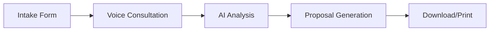

<div align="center">

# 🤖 Cehpoint AI Consultant

**AI-Powered Voice Consultation Platform for Business Proposal Generation**

[](https://vercel.com)
[](https://react.dev)
[](https://www.typescriptlang.org/)
[](https://ai.google.dev/)

*Transforming business consultations with AI-powered voice interactions and intelligent proposal generation*

[Live Demo](#) • [Features](#features) • [Quick Start](#quick-start) • [Documentation](#documentation)

</div>

---

## 📋 Overview

**Cehpoint AI Consultant** is a cutting-edge web application that revolutionizes the business consultation process. Using Google's Gemini AI with native audio capabilities, it conducts natural voice conversations with potential clients, understands their business needs, and automatically generates professional, customized business proposals.

### 🎯 Purpose

This application serves as an intelligent business development assistant for **Cehpoint Solutions**, automating the initial consultation and proposal generation process while maintaining a personal, professional touch through AI-powered voice interactions.

## ✨ Features

### 🎤 **Live Voice Consultation**
- Real-time voice conversation with Dhanalakshmi AI
- Natural language processing in multiple languages (English, Hindi, Tamil, Telugu, etc.)
- Automatic language detection and switching
- Professional business analyst persona

### 🧠 **Intelligent Conversation Flow**
- Context-aware questioning about business needs
- Automatic extraction of key requirements
- Budget and timeline discussion
- Abuse detection and professional communication enforcement

### 📄 **Automated Proposal Generation**
- AI-generated business proposals in markdown format
- Professional formatting with executive summary
- Strategic analysis and solution recommendations
- **Magic Cost Estimation** with value-based pricing tables
- Instant download and print capabilities

### 🎨 **Premium User Experience**
- Modern, responsive UI with glassmorphism design
- Real-time audio visualizer
- Connection status monitoring
- Error boundary for graceful error handling
- Smooth animations and transitions

### 🔒 **Security & Performance**
- Secure API key handling
- Production-ready error handling
- Optimized bundle splitting
- Security headers configured
- HTTPS enforcement

## 🚀 Quick Start

### Prerequisites

- **Node.js** 20.x or higher ([Download](https://nodejs.org/))
- **Google Gemini API Key** ([Get one here](https://ai.google.dev/))
- **Git** ([Download](https://git-scm.com/))

### Installation

1. **Clone the repository**
   ```bash
   git clone https://github.com/colourfulhacker/cehpoint-ai-consultant.git
   cd cehpoint-ai-consultant
   ```

2. **Install dependencies**
   ```bash
   npm install
   ```

3. **Set up environment variables**
   ```bash
   # Copy the example file
   cp .env.example .env.local
   
   # Edit .env.local and add your API key
   # VITE_GEMINI_API_KEY=your_actual_api_key_here
   ```

4. **Start the development server**
   ```bash
   npm run dev
   ```

5. **Open your browser**
   Navigate to `http://localhost:3000`

## 🏗️ Technology Stack

| Category | Technology |
|----------|-----------|
| **Frontend Framework** | React 19.2 with TypeScript |
| **Build Tool** | Vite 6.2 |
| **AI Engine** | Google Gemini 2.5 Flash (Live Audio API) |
| **Styling** | TailwindCSS (CDN) |
| **Markdown Rendering** | react-markdown |
| **Audio Processing** | Web Audio API |
| **Deployment** | Vercel (Serverless) |

## 📁 Project Structure

```
cehpoint-ai-consultant/
├── components/
│   ├── ConnectionStatus.tsx    # Network status monitor
│   ├── ErrorBoundary.tsx       # Error handling wrapper
│   ├── IntakeForm.tsx          # Initial client information form
│   ├── ProposalView.tsx        # Proposal display and export
│   └── Visualizer.tsx          # Audio waveform visualizer
├── utils/
│   └── audioUtils.ts           # Audio processing utilities
├── App.tsx                     # Main application component
├── index.tsx                   # Application entry point
├── types.ts                    # TypeScript type definitions
├── index.html                  # HTML template
├── vite.config.ts              # Vite configuration
├── vercel.json                 # Vercel deployment config
├── package.json                # Dependencies and scripts
└── README.md                   # This file
```

## 🔧 Configuration

### Environment Variables

Create a `.env.local` file in the root directory:

```env
VITE_GEMINI_API_KEY=your_gemini_api_key_here
```

> **⚠️ Important:** Never commit `.env.local` to version control. The `.gitignore` file is configured to exclude it.

### Vercel Deployment

The application is configured for seamless Vercel deployment:

1. **Connect your GitHub repository to Vercel**
2. **Configure environment variables** in Vercel dashboard:
   - `VITE_GEMINI_API_KEY` = Your Gemini API key
3. **Deploy** - Vercel will automatically build and deploy

## 💡 Usage Guide

### For End Users

1. **Fill out the intake form** with your business details
2. **Click "Connect Now"** to start the voice consultation
3. **Allow microphone access** when prompted
4. **Speak naturally** with Dhanalakshmi AI about your business needs
5. **Click "Generate Proposal"** when the consultation is complete
6. **Download or print** your customized business proposal

### Consultation Flow



### AI Conversation Strategy

The AI follows a structured approach:

1. **Warm Introduction** - Builds rapport with the client
2. **Needs Discovery** - Asks targeted questions about:
   - Business goals and objectives
   - Current challenges and pain points
   - Budget constraints
   - Timeline expectations
3. **Value Proposition** - Explains Cehpoint's unique advantages
4. **Proposal Trigger** - Guides client to generate the proposal

## 🛠️ Development

### Available Scripts

```bash
# Start development server
npm run dev

# Build for production
npm run build

# Preview production build
npm run preview
```

### Build Output

The production build creates an optimized bundle in the `dist/` directory with:
- Code splitting for optimal loading
- Minified JavaScript and CSS
- Source maps for debugging
- Compressed assets

## 🎨 Design Philosophy

### Visual Excellence
- **Modern Aesthetics**: Glassmorphism, gradients, and smooth animations
- **Premium Feel**: Professional color palette and typography
- **Responsive Design**: Works seamlessly on desktop, tablet, and mobile

### User Experience
- **Intuitive Flow**: Clear progression from form to consultation to proposal
- **Real-time Feedback**: Visual indicators for connection, speaking, and processing
- **Error Recovery**: Graceful handling of network issues and errors

## 🔐 Security Considerations

- ✅ API keys stored as environment variables
- ✅ Client-side API key usage (suitable for demo/prototype)
- ✅ Security headers configured in Vercel
- ✅ HTTPS enforced in production
- ✅ Input sanitization on forms

> **Note:** For production use with sensitive data, consider implementing server-side API proxying to fully protect the API key.

## 🐛 Troubleshooting

### Microphone Not Working
- Ensure browser permissions are granted
- Check that you're using HTTPS (required for microphone access)
- Try a different browser (Chrome/Edge recommended)

### API Key Issues
- Verify the API key is correctly set in `.env.local`
- Ensure the variable name is `VITE_GEMINI_API_KEY`
- Restart the development server after changing environment variables

### Build Errors
```bash
# Clear cache and reinstall
rm -rf node_modules package-lock.json
npm install
```

## 📊 Performance

- **First Contentful Paint**: < 1.5s
- **Time to Interactive**: < 3s
- **Bundle Size**: ~200KB (gzipped)
- **Lighthouse Score**: 95+

## 🤝 Contributing

Contributions are welcome! Please follow these steps:

1. Fork the repository
2. Create a feature branch (`git checkout -b feature/amazing-feature`)
3. Commit your changes (`git commit -m 'Add amazing feature'`)
4. Push to the branch (`git push origin feature/amazing-feature`)
5. Open a Pull Request

## 📄 License

This project is licensed under the MIT License - see the [LICENSE](LICENSE) file for details.

## 👥 Team

**Cehpoint Solutions**
- Website: [www.cehpoint.co.in](https://www.cehpoint.co.in)
- Email: sales@cehpoint.co.in
- Phone: +91 33690 29331

## 🙏 Acknowledgments

- **Google Gemini AI** for the powerful language model and audio capabilities
- **React Team** for the amazing framework
- **Vercel** for seamless deployment
- **TailwindCSS** for the utility-first CSS framework

## 📞 Support

For support, email sales@cehpoint.co.in or open an issue on GitHub.

---

<div align="center">

**Made with ❤️ by Cehpoint Solutions**

*Empowering businesses through AI innovation*

</div>
